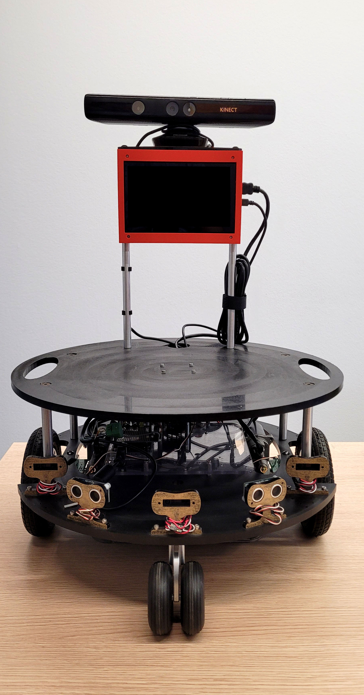
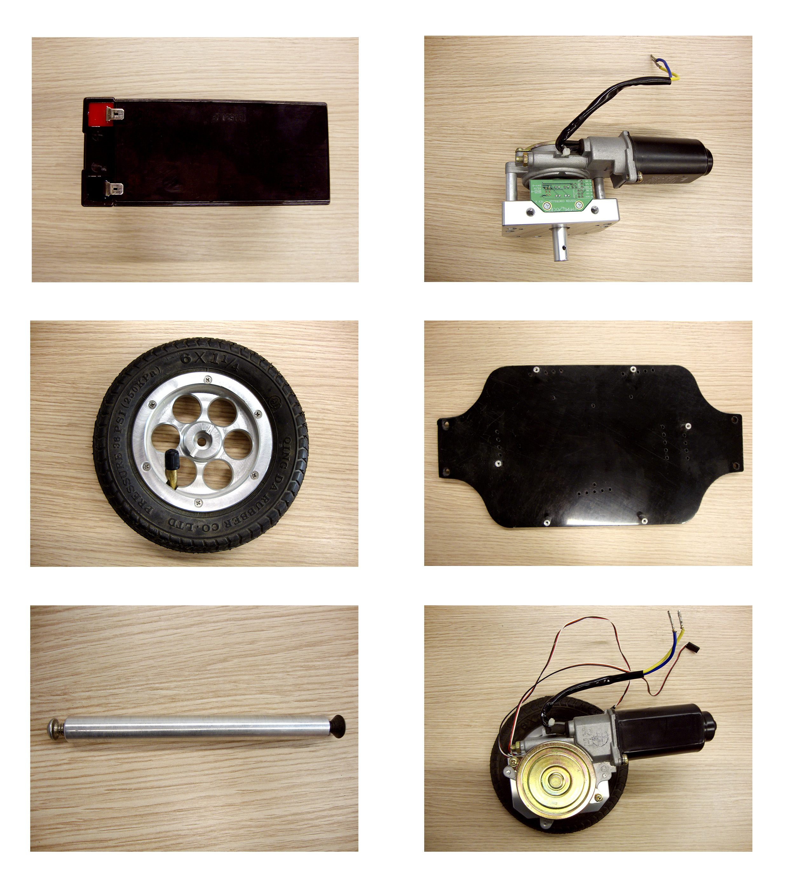
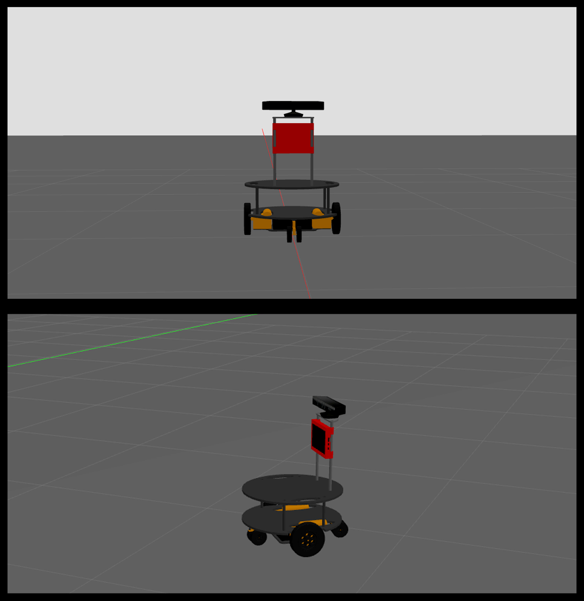

 # Gémelo digital Robot Eddie

Este repositorio contiene el material generado durante el Trabajo de Fin de Grado, el cual aborda el diseño e implementación de un gemelo digital funcional del robot móvil Eddie, utilizando la plataforma ROS 1 (Noetic Ninjemys) la cual esta pensada para Ubuntu 20.04. En una primera fase, el desarrollo se centró en la simulación y validación de las capacidades básicas de movilidad del gemelo digital del robot.

## Recursos del proyecto

| Sección                    | Descripción                        |
|----------------------------|------------------------------------|
| [Código](eddiebot_description)      | Código del proyecto |
| [Piezas del robot en 2D](doc/figs_2D)      | Imágenes de las piezas individuales del robot en 2D |
| [Piezas del robot en 3D](doc/figs_3D)      | Imágenes de las piezas individuales del robot en 3D |
| [Soporte pantalla](doc/figs_SopPantalla)   | Fotos del soporte y diseño que se hizo para la pantalla del robot real |
| [Capturas de la simulación en Gazebo y RVIZ](doc/figs_simulacion) | Visualizaciones de sensores y modelos en RViz y gazebo |
| [Trabajo de fín de grado](doc/TFG_IGPESE.pdf)      | Documento final del TFG en formato PDF |

Imágenes del robot real junto con sus componentes.
<table align="center">
  <tr>
    <td></td>
    <td></td>
  </tr>
</table>

Representaciones del gemelo digital simuladas en Gazebo.
<table align="center">
  <tr>
    <td></td>
  </tr>
</table>

Como objetivo a futuro, se plantea la migración a ROS 2 para la realización de pruebas de movimiento para el Trabajo de Fin de Máster (TFM).

